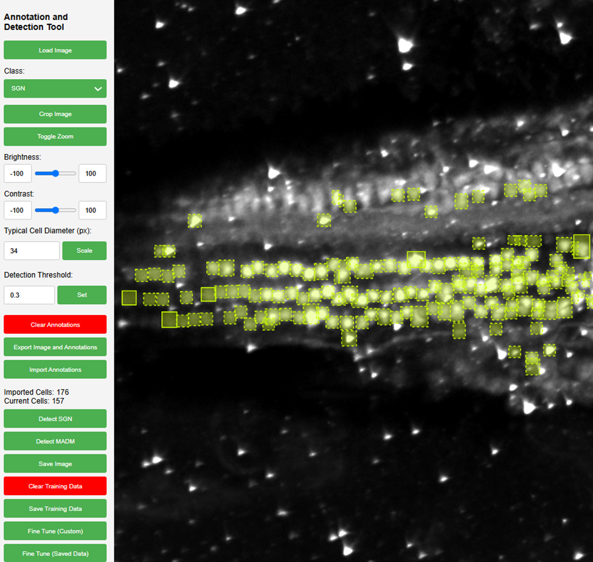
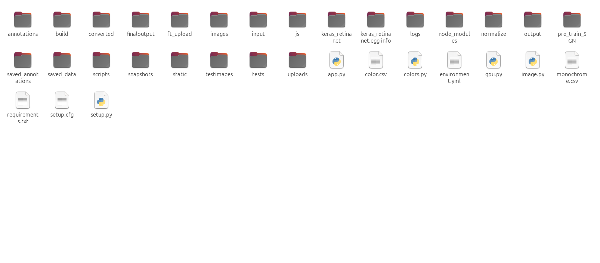

# Automatic Cell Annotation Tool

[](https://youtu.be/IhLrQrVeXEQ)

A machine learning-based tool for automated detection and annotation of **Spiral Ganglion Neurons (SGN)** cells in microscope images. Built on the `keras-retinanet` framework, this tool enables biologists to deploy and refine object detection models without requiring programming expertise.



## Features

- **Automated Detection**: Pre-trained models for SGN cell detection.
- **Real-Time Analysis**: Dynamic cell counting during image processing.
- **Annotation Editing**: Add, modify, or remove annotations post-detection.
- **Model Customization**: 
  - Fine-tune models using custom datasets or prior annotations.
  - Retrain models for improved accuracy.
- **Image Preprocessing**: Adjust brightness, contrast, and zoom; set brightness/contrast thresholds.
- **Cross-Platform Accessibility**: Hosted on a static IP for network-wide access.

---

## Installation

### Prerequisites
- **Anaconda**: Install from [Anaconda Documentation](https://docs.anaconda.com/anaconda/install/index.html).
- **Linux Environment**: Tested on Ubuntu 20.04 LTS.

### Steps

1. **Clone and Configure Repositories**:
   ```bash
   git clone https://github.com/fizyr/keras-retinanet.git
   mv keras-retinanet keras_retinanet
   ```
**Replace Core Files**:

Overwrite the following files in keras_retinanet/utils/ with those provided in this repository:

```
image.py
```
```
colors.py
```
```
gpu.py
```
**Modify training script**:

In keras_retinanet/keras_retinanet/bin/train.py, set steps = None (default: 10000).

Set Up Conda Environment:


```
conda env create -f environment.yml
conda activate environment
pip install -r requirements.txt
```
**Install keras-retinanet in Editable Mode:**


```
cd keras_retinanet
pip install cython numpy
python setup.py build_ext --inplace
pip install --use-pep517 -e .
```

**Verify Installation**:

```
python
import keras_retinanet
print(keras_retinanet.__file__)  # Ensure path points to the local repository.
```

## Deployment
**Directory Structure**

Create the following directories if they do not exist:

```
uploads/
images/
input/
output/output_csv/
ft_upload/
saved_annotations/
saved_data/
converted/         # Clear manually to avoid PNG accumulation
finaloutput/
snapshots/         # Critical for model weights
```

**Pre-Trained Weights**

Download and place these files in /snapshots:

[SGN_Rene.h5](https://drive.google.com/file/d/10JCk6W6pC7nVWfHJ7Ew6xvyWLEeKxbV2/view?usp=sharing)
[combine.h5](https://drive.google.com/file/d/1ADUyTbD1wxKvsMnuvF0YZr5K9Wn5iwk3/view?usp=sharing)

Launch Application
Run the server:

```
python app.py
```
Access the tool via browser:

```
http://127.0.0.1:5000/static/index.html
```
For network access, replace 127.0.0.1 with the host machine's IP.

**Directory Structure Example**



## Usage

- Load Image- Allows import of .tif/.tiff files
- Class - SGN (MADM cell detection is currently in development stage, so there are other classes as well)
- Crop Image - Click and drag an area to crop a section of an image
T- oggle Zoom - When active, use mousewheel to zoom in/out, and drag to pan around the image.
- Visibility can be adjusted using the brightness/contrast slider. The maximum and minimum threshold values for both can also be changed.

- Typical Cell Diameter (px) - adjusts image according to the typical cell diameter of the image, in pixels.
- Detection Threshold - Adjust the threshold value during cell detection.
- Clear annotations - Clears all annotations within the image.
- Export Image and Annotations - Exports the current tiff image and its associated annotations into a zip file.
- Import Annotations - Import annotations from a .csv file onto the uploaded image.
- Detect SGN - Detect neurons present in the image.
- Clear training data - Clear pre-existing data used for training (explained in further steps)
- Save Training Data - Once an image is imported and annotated, you can use this data to train the model and improve detection. The clear training data button can clear these annotations if you want to use fresh data without mixing it with old data.
- Fine-tune(Custom) - Upload a .csv file in keras-retinanet format containing annotations, and its associated images, and enter the number of epochs. The trained model weight is automatically downloaded to your PC.
- Fine-tune(Saved Data) - fine tune the model by entering the number of epochs. The fine-tuned trained model weight is automatically downloaded to your PC.
- Custom Detect - Once an image is uploaded, you can test your newly downloaded weight on the image and see its detection performance.
- Save Image - Saves displayed image and its annotations as a PNG and downloads it.

Annotating:
- Click and drag (when not in crop or zoom mode) to make an annotation
- Right click on an annotation to delete it


## Acknowledgements

 - [COMBINe: Cell detectiOn in Mouse BraIN](https://github.com/yccc12/COMBINe/tree/main)
 - [keras-retinanet](https://github.com/fizyr/keras-retinanet)
